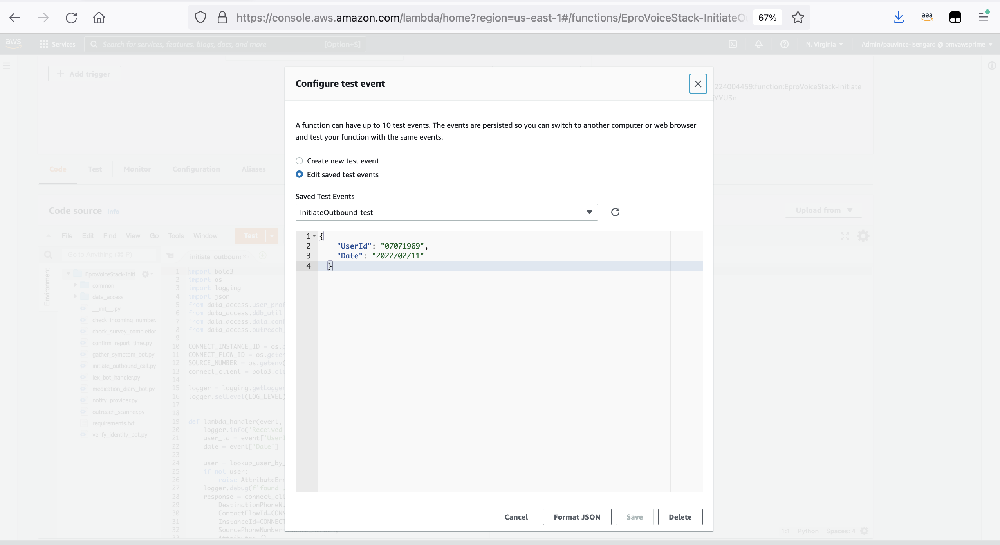

# Voice enabled patient outcome reporting

This repo contains a sample application to show how to build a voice interface for **patient outcome reporting** (PRO) by leveraging NLP capabilities provided by Amazon Lex and its integration with AWS's cloud contact center offering, Amazon Connect. The hands-free nature of a voice interface make patient diary reporting more accessible to a broader set of patients who may not be able to use a mobile app due to physical constraints such as vision or motion impairments. 

### Example recording

Click below to hear an example for a patient diary reporting call using the sample application:
https://voice-enabled-patient-dairy-blog.s3.amazonaws.com/outbound+patient+reporting.mp3 

## Architecture


The application supports three different ways for patients to reach the patient diary voice reporting interface: 
- Making an inbound call through their smart phone or landline
- Making an inbound call through a smart speaker such as Amazon Echo
- Receiving an outbound call on their smart phone or landline –  initiated by an automated patient outreach scheduler that leverages the StartOutboundContact API of Amazon Connect 

## Deployment and Testing Instructions 

### Prerequisites 

Ensure you have the following in place before deploying the application 

* An [**AWS account**](https://portal.aws.amazon.com/billing/signup) in which you have administrative permissions 
* [**AWS cli**](https://aws.amazon.com/cli/) installed and configured with your AWS account
* **Python 3** and [**pipenv**](https://pypi.org/project/pipenv/) installed
* [**node.js**](https://nodejs.org/), [**typescript**](https://www.typescriptlang.org/), and [**AWS CDK**](https://docs.aws.amazon.com/cdk/latest/guide/getting_started.html) installed 
* **Docker** installed (required by CDK to [package Python lambda functions](https://docs.aws.amazon.com/cdk/api/latest/docs/aws-lambda-python-readme.html))

### Setup steps

1. Clone this Github repo using `git clone` 
1. In the cloned code directory, install python dependencies using `pipenv`: 
    
    ```
    pipenv --three shell
    pipenv install --dev
    ```
1. Find the `lib/ddb-seed/patient-profile-setup.json` file - this file is used to seed the DynamoDB table that will look up the patient's profile data. Fill in the fields with information you'd like to test the application with.

    ```
    [
      {
        "Patient_ID": "07071969",
        "First_Name": "<your name>",
        "Phone_Num": "<your phone number",
        "Time_Zone": "US/Eastern",
        "Zip_Code": "<test-zipcode"
      }
    ]
    ```
    
    Especially note to fill in the `Phone_Num` field with **number of the phone you'd like to test calling the patient diary app with**.
    Also, leave the `Patient_ID` random ID as is, this is referenced by the trial config table on which patients is associated with which trials. 
    For example:     

    ```
    [
      {
        "Patient_ID": "07071969",
        "First_Name": "Angela",
        "Phone_Num": "+15556667788",
        "Time_Zone": "US/Eastern",
        "Zip_Code": "12345"
      }
    ]
   ```

1. This deployment is configured to run with the **default** CLI profile.  Please ensure your **default profile** is pointing to the account you wish to deploy to.

1. Ensure you have CDK installed by running 

    ```
    cdk --version
    ```
    If you don't have it installed, follow documentation [here](https://docs.aws.amazon.com/cdk/latest/guide/getting_started.html) to install it.

    It's recommended to update CDK to the latest version. Use `npm update -g aws-cdk` to do so. 
    
    Note: Make sure that all the cdk libaries in the `package.json` file matches your cdk version. Edit the `package.json` file to match. 
    
    Install npm dependencies to make sure the cdk dependencies work:
    
    ```
    npm install
    ```


1. Deploy the backend AWS Lambda functions, DynamoDB database tables, and Amazon Lex bots by running the make commands:
    
    ```
    make init
    ```
    
    Then
    
    ```
    make deploy
    ```

1. Log into the [Amazon Connect management console](https://console.aws.amazon.com/connect/home) and [create an **Amazon Connect contact center instance**](https://docs.aws.amazon.com/connect/latest/adminguide/tutorial1-create-instance.html)
1. Claim a phone number by following instructions [here](https://docs.aws.amazon.com/connect/latest/adminguide/tutorial1-claim-phone-number.html), and note down the number for later 
1. Open a new tab, go to  [Amazon Connect management console](https://console.aws.amazon.com/connect/home), under the **Contact flows** tab of the Amazon Connect instance, add the **4 Amazon Lex Bots** and the “**CheckIncomingNumber**” AWS Lambda function deployed in step#3
 
    

1. Create the Amazon Connect contact flow:
    1. Back in the Amazon Connect contact center instance, choose **Routing** → **Contact Flows** → **Create contact flow**, and use the **Import flow (beta) button** on the upper right corner to upload to import this [flow definition](https://github.com/angelarw/voice-enabled-patient-dairy/blob/main/connect/ePRO.json) 
    2. Find the **Invoke AWS Lambda function** block and update the associated Lambda function to the **CheckIncomingNumber** function you added to the contact flow in step # 6
        
        
    
    4. Click **Save** and then **Publish** the contact flow
    
        

    5. Go to **Routing** → **Phone Numbers** and click on the phone number you claimed in step #5 and change the contact flow to point to the `ePRO`  contact flow you just created
        
        

## Running the application

1. You can call the phone number you provisioned for Amazon Connect at this stage. However, you'll probably get a message that you've completed all the surveys. This is expected behavior. 

1. The reporting sample application uses a DynamoDB table `SurveyCompletion` to keep track of the surveys each patient needs to complete for a given day and their completion status. To hydrate this table, you need to run the `SurveyCompletionScanner` AWS Lambda function, which performs the following:
    - scans the `TrialConfig` DynamoDB table for a list of trials, the surveys required for that trial, and a list of participant IDs (assume each patient only participate in one trial at a given point)
    - for each participant, add an entry to the `SurveyCompletion` DynamoDB table for today's date. 

    To run this function, head to the [AWS Lambda console](https://console.aws.amazon.com/lambda/home) and find the Lambda function with `SurveyCompletionScanner` in its name. Use an empty `{}` as the test input data, and click the **Test** button to run the function 

1. You can check the `SurveyCompletion` DynamoDB table to see the entry added by the function you just run

1. Now, call the phone number you provisioned for Amazon Connect and test the reporting workflow. 

1. A separate Lambda function `InitiateOutboundCall` is provided to show an example how to use the Amazon Connect API to automate patient outreach by scheduling to call them. In the test input event, specify the UserId (you can find it in the `PatientProfile` table):

  ```json
  {
    "UserId": "07071969",
    "Date": "2022/02/11"
  }
  ```



## Development 

The AWS Lambda functions and DynamoDB tables in the application is defined by [AWS Cloud Development Kit (CDK)](https://aws.amazon.com/cdk/). The `cdk.json` file tells the CDK Toolkit how to deploy the app

